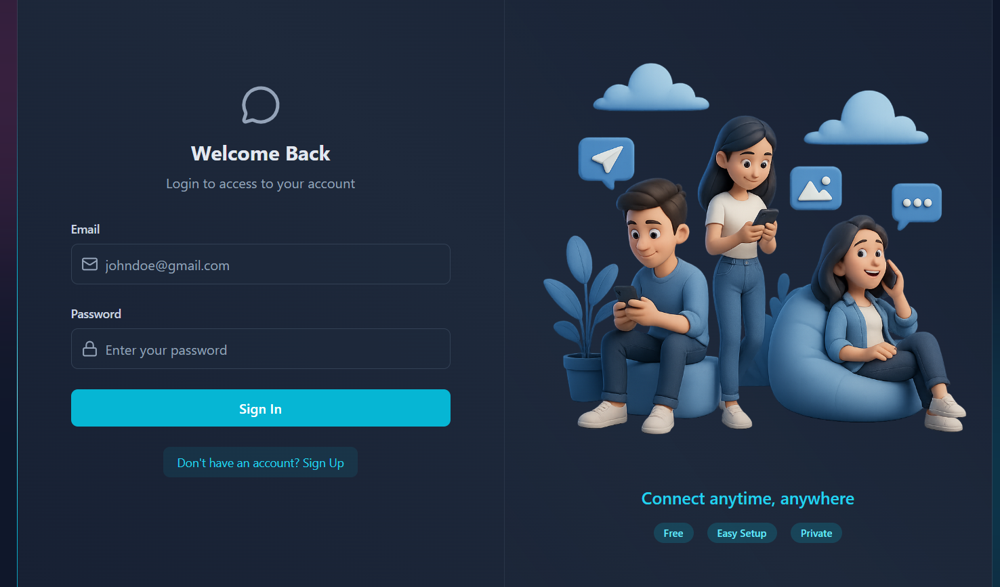
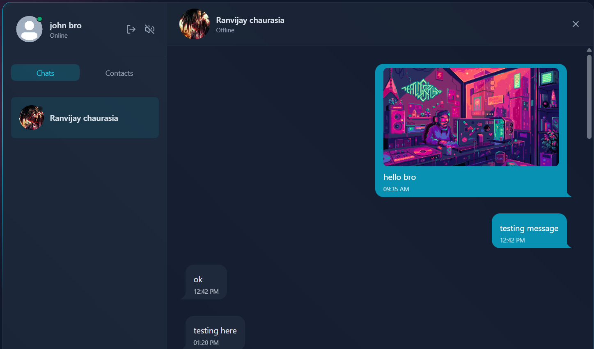

# 💬 Real-Time Chat Application

A full-stack real-time chat application that enables users to communicate instantly using modern web technologies. This app provides seamless messaging with a responsive UI and real-time updates powered by WebSockets.

---

## 🚀 Features

- ⚡ Real-time messaging using WebSocket
- 👤 User authentication (Login / Register)
- 💬 One-to-one chat system
- 🟢 Online / Offline user status
- 📱 Responsive design (mobile + desktop)
- 🔄 Instant message updates without refresh

---

## 🛠️ Tech Stack

### Frontend
- React.js
- CSS / Tailwind (based on your project)
- Axios (for API calls)
- Redux-Toolkit

### Backend
- Node.js
- Express.js
- ws

### Database
- MongoDB (Mongoose)

---

## 📂 Project Structure


## 📂 Project Structure

```bash
Real-Time-Chat-App/
│
├── backend/
│   │
│   ├── src/
│   │   │
│   │   ├── controllers/
│   │   │   ├── auth.controller.js
│   │   │   └── message.controller.js
│   │   │
│   │   ├── emails/
│   │   │   ├── emailHandlers.js
│   │   │   └── emailTemplates.js
│   │   │
│   │   ├── lib/
│   │   │   ├── arcjet.js
│   │   │   ├── cloudinary.js
│   │   │   ├── db.js
│   │   │   ├── env.js
│   │   │   ├── resend.js
│   │   │   ├── utils.js
│   │   │   └── websocket.js
│   │   │
│   │   ├── middleware/
│   │   │   ├── arcjet.middleware.js
│   │   │   └── auth.middleware.js
│   │   │
│   │   ├── models/
│   │   │   ├── Message.js
│   │   │   └── User.js
│   │   │
│   │   ├── routes/
│   │   │   ├── auth.route.js
│   │   │   └── message.route.js
│   │   │
│   │   └── server.js
│   │
│   ├── package.json
│   └── package-lock.json
│
├── frontend/
│   ├── dist/
│   ├── public/
│   │
│   ├── src/
│   │   │
│   │   ├── components/
│   │   │
│   │   ├── hooks/
│   │   │   ├── SocketContext.jsx
│   │   │   └── useKeyboardSound.js
│   │   │
│   │   ├── lib/
│   │   │   └── axios.js
│   │   │
│   │   ├── pages/
│   │   │   ├── ChatPage.jsx
│   │   │   ├── LoginPage.jsx
│   │   │   └── SignUpPage.jsx
│   │   │
│   │   ├── store/
│   │   │   ├── slices/
│   │   │   └── store.js
│   │   │
│   │   ├── App.jsx
│   │   ├── index.css
│   │   └── main.jsx
│   │
│   ├── .gitignore
│   ├── eslint.config.js
│   ├── index.html
│   ├── package.json
│   ├── package-lock.json
│   ├── postcss.config.js
│   ├── tailwind.config.js
│   └── README.md
│
├── .gitignore
├── package.json
├── package-lock.json
└── README.md
```


## ⚙️ Installation & Setup

### 1️⃣ Clone the repository

```bash
git clone https://github.com/Viku4780/Real-Time-Chat-App.git
cd Real-Time-Chat-App
```

### 2️⃣ Install dependencies

Backend
```Bash
cd server
npm install
```

Frontend
```Bash
cd client
npm install
```

### 3️⃣ Environment Variables
Create a .env file inside the server folder:

```env
PORT=3000
MONGO_URI=your_mongodb_url

NODE_ENV=your_development_environment

JWT_SECRET=your_secret_key

RESEND_API_KEY=your_resend_api_key

EMAIL_FROM="your_email
EMAIL_FROM_NAME="your name"

CLIENT_URL=http://localhost:5173

CLOUDINARY_CLOUD_NAME=cloudinary_cloud_name
CLOUDINARY_API_KEY=cloudinary_api_key
CLOUDINARY_API_SECRET=cloudinary_api_secret

ARCJET_KEY=your_arcjet_key
ARCJET_ENV=your_arcjet_environment
```

### 4️⃣ Run the application

Start Backend

```Bash
cd server
npm run dev
```

Start Frontend

```Bash
cd client
npm start
```


## Usage
1. Register or login
2. Start chatting with users in real-time
3. Messages are delivered instantly without page refresh


## 📸 Screenshots





## 🔐 Future Improvements
* ✅ Group chat feature
* ✅ File sharing
* ✅ Message encryption
* ✅ Push notifications
* ✅ Video/voice calling


## 🤝 Contributing

Contributions are welcome!

1. Fork the repo
2. Create a new branch
3. Make your changes
4. Submit a Pull Request


## 📄 License

This project is licensed under the MIT License.


## Author
Vikrant Kumar
* Github: https://github.com/Viku4780


## ⭐ Support

If you like this project, give it a ⭐ on GitHub!
